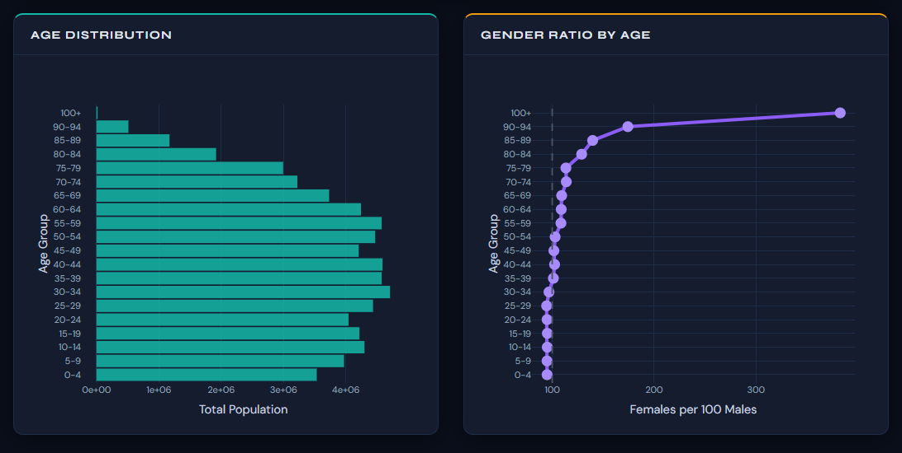
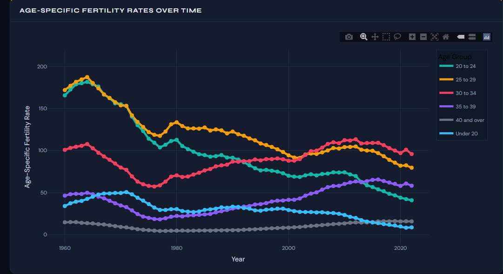
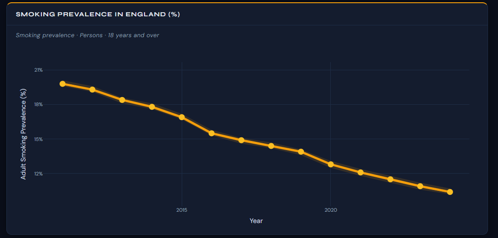

# medical-statistics-dashboard
# 📊 Medical Statistics Dashboard (R Shiny)

## 🚀 Live App
https://akt123.shinyapps.io/medical_statistics/
## 📸 Dashboard Preview

### 📈 Age-Specific Fertility Rates

### 📉 Fertility Trend

## 📌 Overview
This project is an interactive dashboard built using R Shiny to analyze medical and demographic data.

## 🔍 Key Features
- Population pyramid visualization
- Mortality and death rate analysis
- Fertility & age-specific fertility rates (ASFR)
- Life expectancy trends
- Maternity deaths analysis
- Smoking, obesity & physical activity insights
- Leading causes of death comparison

## ⚙️ Technologies Used
- R (Shiny, ggplot2, plotly, tidyverse)
- Reactive programming
- Data visualization
- Dashboard development

## 💡 Purpose
To transform complex healthcare data into interactive and meaningful insights using statistical methods.

## 👨‍💻 Author
Kaveeshya
Mevan-Fernando - https://github.com/Mevan-Fernando
